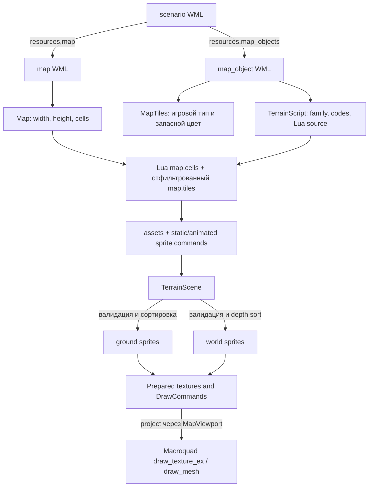

# Как отрисовывается карта

Этот документ описывает текущий путь от WML-файла сценария до пикселей в
окне desktop-клиента `wesnoth-client`. Главная идея системы: игровой движок
хранит карту как прямоугольный массив WML-кодов, отдельные Lua-рендереры один
раз превращают этот массив в декларативную сцену, а Rust-клиент загружает PNG,
готовит текстуры и повторяет небольшой набор команд рисования каждый кадр.

## Короткая схема



На старте сценария эта цепочка выполняется один раз. В кадре не запускаются
WML-парсер, Lua и загрузка PNG: кадр выбирает фазу анимации, проецирует уже
готовые координаты и отправляет draw-вызовы GPU.

## 1. От сценария к `Map`

Точка входа — `[resources]` внутри сценария. Например,
[`first_battle.wml`](../scripts/scenarios/first_battle.wml#L7) задаёт:

```wml
[resources]
    map=maps/first_battle.wml
    map_objects=map_objects/grassland.wml,map_objects/forest.wml,
                map_objects/hills.wml,map_objects/water.wml
    ...
[/resources]
```

[`Game::load_with_campaign_from`](../src/game.rs#L89) читает сценарий, затем
карту и список `map_objects`. Саму карту разбирает
[`load_map`](../src/map.rs#L27):

1. `width` и `height` должны быть положительными;
2. многострочное `data` делится сначала по строкам, потом по запятым;
3. число строк и ячеек проверяется против размеров;
4. результат расплющивается в row-major `Vec<String>`.

Для карты 8×6 из
[`maps/first_battle.wml`](../scripts/maps/first_battle.wml#L1) первые ячейки
будут храниться так:

```text
index:  0          1          2       3        4
cell:   grassland  grassland  forest  grassland hills
coord:  (1,1)      (2,1)      (3,1)   (4,1)    (5,1)
```

Координаты карты везде 1-based. [`Map::raw`](../src/engine.rs#L26) переводит
`(x, y)` в индекс формулой:

```text
index = (y - 1) * width + (x - 1)
```

`raw()` возвращает исходный код (`Ww^Bw|`, `Gg`, `forest`).
[`Map::get`](../src/engine.rs#L22) пропускает его через `gameplay_type()` и
возвращает укрупнённое игровое понятие (`water`, `grassland`, `forest`). Это
важное разделение: бой и перемещение не должны разбирать графические варианты,
а рендереру нужен полный исходный код.

### Составной WML-код

Код вроде `Ww^Bw|` состоит из:

- `Ww` — базовый слой, мелкая вода;
- `^` — разделитель;
- `Bw|` — overlay, вертикальный деревянный мост.

[`visual_codes`](../src/terrain.rs#L74) отделяет base от overlay. Игровой
[`gameplay_type`](../src/terrain.rs#L50) считает мост сушей (`grassland`), а
визуальная подсистема может одновременно нарисовать воду, мост, берег и его
окончания.

## 2. Что дают `map_object`-ресурсы

Каждый файл из `resources.map_objects` содержит один `[map_object]`. Например,
[`grassland.wml`](../scripts/map_objects/grassland.wml#L1):

```wml
[map_object]
    id=grassland
    codes=grassland,Gg,Gs,Gd,Gll
    color=6f914d
    renderer=terrain/grass.lua
[/map_object]
```

[`load_resources`](../src/map.rs#L63) создаёт два набора данных:

- `MapTiles`: соответствие игрового типа запасному RGB-цвету;
- `TerrainScript`: `family`, обслуживаемые WML-коды и исходник Lua.

После загрузки проверяется, что для каждой ячейки карты существует игровой
`map_object`. Неизвестный код останавливает загрузку сценария, а не превращается
в тихо пропущенный тайл.

Порядок `map_objects` значим. Он превращается в `family_order` и используется
как один из ключей сортировки. Поэтому перестановка, например, `grassland` и
`water` в сценарии способна изменить порядок спрайтов с одинаковым `order`.

Цвет из `map_object` не является основной графикой. Он рисуется как сплошной
гекс под PNG и служит фоном/страховкой, если текстура имеет прозрачные области.

## 3. Геометрия гексагональной карты

Карта использует плоские гексы (flat-top) и смещённые столбцы. Чётный 1-based
столбец расположен на полгекса выше нечётного. Центр вычисляет
[`hex_center`](../src/bin/client/map_renderer.rs#L130):

```text
column = x - 1
row    = y - 1
world_x = column * 1.5
world_y = row * 2 - (x чётный ? 1 : 0)
```

Примеры:

| Гекс | Центр в world space |
|---|---:|
| `(1,1)` | `(0.0, 0.0)` |
| `(2,1)` | `(1.5, -1.0)` |
| `(2,2)` | `(1.5, 1.0)` |
| `(3,1)` | `(3.0, 0.0)` |

Условный радиус гекса в world space равен `1`. Эталонный PNG-гекс имеет
радиус 36 px и высоту 72 px. Поэтому в подготовке спрайтов все пиксельные
размеры и смещения делятся на `REFERENCE_RADIUS = 36`.

Например, обычный PNG 72×72 со смещением `(-36, -36)` получает:

```text
size_world   = (72, 72) / 36 = (2, 2)
offset_world = (-36, -36) / 36 = (-1, -1)
top_left     = hex_center(x,y) + (-1,-1)
```

То есть квадрат текстуры точно охватывает bounding box гекса вокруг его
центра. Большая гора может иметь размер 180×216 и отрицательное смещение,
которое помещает её основание на гекс-якорь, а изображение уводит вверх и в
стороны.

Соседство использует ту же staggered-схему. Реализация в
[`Map::neighbors`](../src/engine.rs#L55) и Lua-функции `neighbors`, например в
[`grass.lua`](../scripts/terrain/grass.lua#L41), должна оставаться синхронной.

## 4. Создание декларативной `TerrainScene`

Desktop-клиент строит сцену через
[`TerrainScene::from_lua`](../src/terrain_scene.rs#L88). Для каждого семейства
создаётся отдельная безопасная Lua-машина:

- разрешена только `StdLib::ALL_SAFE`;
- удалены `io`, `os`, `package`, `dofile`, `loadfile`, `require`;
- Lua-файл должен вернуть функцию `render(map)`;
- функция возвращает `{ assets, static, animated }`.

### Вход Lua-рендерера

[`map_table`](../src/terrain_scene.rs#L214) передаёт Lua две проекции карты:

```lua
map = {
    width = 8,
    height = 6,
    cells = {
        { "grassland", "grassland", "forest", ... },
        ...
    },
    tiles = {
        { x = 1, y = 1, code = "grassland", terrain = "grassland" },
        ...
    }
}
```

`cells` содержит всю карту и нужен для анализа соседей. `tiles` содержит лишь
ячейки, подходящие текущему семейству по base или overlay. Например,
`grass.lua` видит в `tiles` только `grassland/Gg/Gs/Gd/Gll`, но через `cells`
может узнать, что сосед — вода или дорога.

### Выход Lua-рендерера

Минимальный статический спрайт выглядит так:

```lua
assets["green"] = "assets/wesnoth/terrain/grass/green.png"
static[#static + 1] = {
    asset = "green",
    x = 4,
    y = 2,
    offset_x = -36,
    offset_y = -36,
    order = -1000,
    pass = "ground",
}
```

Анимированный вариант вместо `asset` содержит:

```lua
{
    frames = { "water01", "water02", ... },
    frame_ms = 125,
    phase_ms = 250,
    x = 6, y = 2,
    clips = { {x = 6, y = 2} },
    crop = {270, 36, 72, 72},
}
```

[`read_command`](../src/terrain_scene.rs#L276) переводит таблицу в
`PlacedSprite`. Значения по умолчанию: `pass="ground"`, нулевые offset,
baseline и order, opacity 255. Для анимации требуется минимум два кадра и
положительный `frame_ms`.

Идентификаторы ассетов получают префикс семейства: `green` из grass превращается
в `grassland:green`. Это предотвращает коллизии одинаковых локальных имён из
разных Lua-файлов.

## 5. Как Lua выбирает конкретную графику

Lua-рендереры не рисуют. Они анализируют топологию карты и выпускают команды.
Такой слой удобен тем, что сложные правила вариантов и соседей отделены от GPU.

### Пример: вариант травы

В [`grass.lua`](../scripts/terrain/grass.lua#L4) для `Gg` описаны восемь
вариантов `green*.png`. [`base_asset`](../scripts/terrain/grass.lua#L97)
вычисляет детерминированный hash из координат и имени правила. Один и тот же
гекс всегда получает один и тот же вариант после перезапуска; карта не мерцает
случайным декором между кадрами.

Базовая трава выпускается с `order=-1000`. Затем скрипт рассматривает каждое
ребро, выбирает направленный transition (`green-long-ne`, например) и через
`claimed` не позволяет двум правилам занять одно ребро. Для leaf litter
соседние ребра объединяются в длинные серии по три, два или одно: сначала
самый длинный доступный PNG, затем остатки.

### Пример: вода и анимация

[`water.lua`](../scripts/terrain/water.lua#L30) различает океан (`Wo*`) и мелкую
воду (`Ww*`). Океан имеет 21 кадр, мелкая вода — 17. Команда создаётся с
`order=-999` и `frame_ms=125`.

Исходные кадры воды являются sprite sheets. Функция
[`crop`](../scripts/terrain/water.lua#L61) выбирает прямоугольник 72×72 в
зависимости от координат гекса. Это распределяет разные фазы узора по карте и
компенсирует вертикальный сдвиг чётных столбцов.

Берега строятся отдельно:

1. `edges()` находит последовательности подходящих граней;
2. сначала пытается занять серии длиной 6, 4, 3, 2, затем 1;
3. выпускает один PNG с суффиксом направлений;
4. `corners()` собирает маски выпуклых/вогнутых углов;
5. волны получают собственные 13 кадров по 200 мс.

Поэтому один водяной гекс может породить базовую анимацию, цветовой overlay,
берег, угловую маску и волны. Это ожидаемо: ячейка карты и draw-команда не
находятся в отношении один-к-одному.

### Пример: большая гора

[`hills.lua`](../scripts/terrain/hills.lua) сначала пытается сопоставить
многогексовые шаблоны. `claim()` помечает использованные позиции, чтобы одна
ячейка не вошла сразу в два горных массива. Каждая часть массива получает:

- общий anchor;
- `pass="world"`;
- собственный offset и baseline;
- общий список `clips`, описывающий footprint массива.

Если крупный шаблон не подошёл, выпускается одиночная гора. Детерминированная
вероятность обеспечивает стабильный, но неодинаковый вид массивов.

## 6. Проверка и порядок слоёв

[`TerrainScene::compile`](../src/terrain_scene.rs#L100) проверяет сцену до
создания GPU-текстур:

- нет повторяющихся asset id;
- каждый sprite ссылается на существующие assets;
- каждая маска зарегистрирована;
- анимация непуста и имеет ненулевую длительность.

Затем спрайты разделяются на два прохода.

### Ground pass

Сортировка в [`terrain_scene.rs`](../src/terrain_scene.rs#L138):

```text
(local_order, family_order, anchor.y, anchor.x)
```

Чем меньше `order`, тем раньше команда рисуется и тем ниже она оказывается.
Типичные значения: базовая поверхность около `-1000`, берега и переходы около
`-550..-180`, мосты ближе к `-10`.

### World pass

Для высоких объектов нужен painter's algorithm. Сначала сравнивается
`local_order`, затем [`world_depth`](../src/terrain_scene.rs#L397):

```text
hex_y_px = (anchor.y - 1) * 72 - (anchor.x чётный ? 36 : 0)
depth    = hex_y_px + baseline
```

Меньшая глубина рисуется раньше. `baseline` должен указывать визуальную линию
касания объекта с землёй, а не верх PNG. Поэтому две перекрывающиеся горы
сортируются по основанию, хотя обе картинки выходят далеко вверх.

Существенная деталь: `local_order` сравнивается раньше depth. Объекты разных
order принадлежат разным глобальным стратам; геометрическая глубина решает
порядок только внутри одной страты.

## 7. Загрузка PNG и предварительная обработка

[`SpriteRenderer::load`](../src/bin/client/sprite_renderer.rs#L39) вызывается
один раз при открытии сценария:

1. строится `TerrainScene`;
2. все уникальные исходные PNG загружаются через `load_image`;
3. для каждой пары `(asset, ImageModifiers)` создаётся либо переиспользуется
   текстура;
4. фильтрация ставится в `Nearest`;
5. `PlacedSprite` превращается в компактный `DrawCommand`.

Кэш ключуется не только asset id, но и модификаторами. Один исходный PNG с
двумя разными crop/mask/opacity становится двумя подготовленными текстурами;
полностью одинаковые комбинации переиспользуют GPU-текстуру.

### Порядок обработки изображения

[`modify_image`](../src/bin/client/sprite_renderer.rs#L225) выполняет операции
на CPU только при загрузке:

1. crop прямоугольника;
2. объединение alpha всех масок по source-over;
3. пересечение alpha исходника с итоговой маской;
4. умножение на opacity.

Для двух масок с alpha 128 объединённая маска имеет примерно 192:

```text
union(128,128) = 128 + 128 * (255-128) / 255 ≈ 192
```

Если alpha исходного пикселя 200 и opacity 127:

```text
result_alpha = min(200,192) * 127 / 255 ≈ 95
```

Именно это закрепляет тест
[`image_operations_follow_wml_crop_mask_and_opacity_order`](../src/bin/client/sprite_renderer.rs#L258).

## 8. Что происходит каждый кадр

Главный порядок находится в [`GameScreen::draw`](../src/bin/client/screens/game.rs#L43):

```text
1. clear_background
2. viewport.update
3. MapRenderer.draw_base
4. SpriteRenderer.draw_ground
5. SpriteRenderer.draw_world
6. MapRenderer.draw_codes
7. MapRenderer.draw_grid
```

Следствия этого порядка:

- цветные гексы всегда под PNG;
- весь ground находится под всем world;
- коды террейна сейчас рисуются поверх художественной карты;
- линии сетки и золотая рамка выбранного гекса рисуются последними;
- текущий `GameScreen` пока не рисует игровые объекты/юнитов: поле `_game`
  удерживает состояние, но snapshot в кадре не запрашивается.

Последний пункт легко пропустить. В этом новом клиенте реализован просмотр
terrain и выбор гекса, а полноценный слой юнитов ещё предстоит встроить между
terrain/world/UI с явно выбранной политикой глубины.

### Выбор кадра анимации

[`PreparedFrames::at`](../src/bin/client/sprite_renderer.rs#L174) использует:

```text
frame_index = ((elapsed_ms + phase_ms) / frame_ms) % frame_count
```

`phase_ms` разносит одинаковые анимации по фазе. Сам `elapsed_ms` берётся из
монотонного времени Macroquad в начале кадра, поэтому все команды кадра видят
одно и то же время.

### Проекция и отсечение экрана

[`MapViewport::project`](../src/bin/client/map_viewport.rs#L92):

```text
screen_point = screen_size / 2 + (world_point - camera_center) * zoom
```

После проекции `SpriteRenderer::draw` умножает размер текстуры на zoom и делает
простую проверку пересечения прямоугольника со viewport. Полностью невидимый
спрайт не отправляется GPU.

Обычный спрайт рисуется одним
[`draw_texture_ex`](../src/bin/client/sprite_renderer.rs#L90). Если заданы
`clip_hexes`, строится mesh:

1. для каждого гекса создаётся шестиугольник;
2. он обрезается прямоугольником PNG алгоритмом последовательного clipping по
   четырём границам;
3. UV вычисляется относительно прямоугольника текстуры;
4. многоугольник триангулируется fan-способом;
5. общий mesh рисуется через `draw_mesh`.

Clipping нужен большим горам и волнам: PNG может покрывать несколько гексов,
но конкретное правило разрешает показывать его только внутри своего footprint.
Дополнительное обрезание по границам PNG не даёт UV выйти за `[0,1]` и размазать
краевые пиксели.

## 9. Камера, zoom и hit testing

[`MapRenderer::new`](../src/bin/client/map_renderer.rs#L25) один раз создаёт
кэш всех ячеек: позиция, world-центр, цвет и исходный код. Одновременно
вычисляется bounding box карты с запасом на радиус гекса.

[`MapViewport::new`](../src/bin/client/map_viewport.rs#L19) центрирует карту и
выбирает zoom, который помещает bounds в окно с полями 16 px с каждой стороны:

```text
fit_zoom = min(
    (screen_width  - 32) / map_width_world,
    (screen_height - 32) / map_height_world
)
```

Управление в [`MapViewport::update`](../src/bin/client/map_viewport.rs#L35):

- `Home` снова вписывает всю карту;
- колесо меняет целевой zoom в 1.25 раза за шаг;
- zoom ограничен диапазоном `fit .. fit*8`;
- масштабирование якорится под курсором: world-точка под мышью остаётся на
  месте;
- zoom плавно приближается к цели экспоненциальной интерполяцией;
- drag начинается левой кнопкой после перемещения минимум на 6 px;
- отпускание без drag возвращает world-точку клика.

Клик переводится обратно формулой `unproject`, затем
[`MapRenderer::hex_at`](../src/bin/client/map_renderer.rs#L117) проверяет точное
попадание в flat-top hex:

```text
abs(y) <= 1  AND  abs(x) <= 1 - abs(y)/2
```

Если по геометрической границе подходят несколько кандидатов, выбирается центр
с минимальным квадратом расстояния.

## 10. Цветная подложка, коды и сетка

[`draw_base`](../src/bin/client/map_renderer.rs#L52) рисует каждый гекс шестью
треугольниками. Здесь пока нет culling: обходятся все ячейки даже за экраном.

[`draw_codes`](../src/bin/client/map_renderer.rs#L82) центрирует исходный WML-код
в гексе и рисует его дважды: чёрная тень со смещением `(1,1)`, затем белый
текст. Размер шрифта зависит от zoom и ограничен 10–18 px.

[`draw_grid`](../src/bin/client/map_renderer.rs#L60) рисует шесть линий каждого
гекса. Обычная толщина масштабируется и ограничена 0.5–1.5 px; выбранный гекс
всегда получает золотую линию толщиной 3 px.

## 11. Два рендер-пути в репозитории

В коде существует более старый путь
[`terrain::build_visuals`](../src/terrain.rs#L79). Он компилирует карту в
`VisualTile` средствами Rust и компактного
[`graphics.wml`](../scripts/terrain/graphics.wml#L1). Его сейчас использует
[`terrain-viewer`](../src/bin/terrain_viewer.rs#L57) и многочисленные тесты
геометрии.

Основной desktop-клиент этот путь **не вызывает**. Он использует
`TerrainScene::from_lua` и Lua-файлы семейств. Это означает:

- правка `graphics.wml` может изменить terrain-viewer, но не игровой клиент;
- правка `grass.lua`/`water.lua` меняет клиент, но не старый `VisualTile`-путь;
- некоторые алгоритмы существуют в двух реализациях и могут разойтись;
- тесты нужно читать по вызываемому API, а не только по названию terrain.

Это главный архитектурный риск текущей подсистемы. При дальнейшей разработке
стоит либо окончательно назначить Lua-путь единственным источником истины, либо
явно сформулировать разные назначения двух компиляторов сцены.

## 12. Где искать проблему по симптому

| Симптом | Сначала смотреть |
|---|---|
| Сценарий не открывается, неизвестный код | `map.rs::load_resources`, список `map_objects` |
| Неверный тип проходимости | `terrain.rs::gameplay_type` |
| Пропал PNG или маска | `TerrainScene::compile`, таблица `assets` Lua-рендерера |
| Неверный вариант травы/горы | hash/`noise` соответствующего Lua-файла |
| Двойной берег или переход | `claimed`/flags и порядок правил Lua |
| Объект рисуется перед соседом | `order`, `pass`, `baseline`, `world_depth` |
| Большой PNG вылез за нужные гексы | `clips`, offsets и mesh clipping |
| Вода синхронно мерцает | `phase_ms` и формула выбора кадра |
| Клик выбирает соседний гекс | `project/unproject`, `hex_center`, `point_in_hex` |
| Изменение видно в terrain-viewer, но не в игре | изменён старый `build_visuals`, а не Lua scene |

## 13. Тесты, закрепляющие поведение

Основные проверки находятся в
[`tests/terrain_loading.rs`](../tests/terrain_loading.rs#L1): они загружают
реальные сценарии, строят `TerrainScene` и проверяют ассеты, переходы, дороги,
декор, горы и координаты clipping.

Дополнительные локальные тесты проверяют:

- сортировку ground/world и контракт Lua —
  [`terrain_scene.rs`](../src/terrain_scene.rs#L403);
- hit testing и staggered-столбцы —
  [`map_renderer.rs`](../src/bin/client/map_renderer.rs#L173);
- fit, Windows wheel delta и плавный zoom —
  [`map_viewport.rs`](../src/bin/client/map_viewport.rs#L146);
- crop/mask/opacity, clipping и анимации —
  [`sprite_renderer.rs`](../src/bin/client/sprite_renderer.rs#L254).

Для полного регрессионного прогона:

```powershell
cargo test --locked
```

Для визуального исследования старого `VisualTile`-пути:

```powershell
cargo run --bin terrain-viewer -- rooting_out_a_mage
```

Для основного Lua-пути нужно запускать клиент:

```powershell
cargo run --bin wesnoth-client
```

## 14. Итоговая модель одного кадра

Удобно держать в голове следующую последовательность:

1. **WML задаёт факты:** размеры и один составной код на гекс.
2. **Map objects назначают обработчиков:** какие Lua-семейства отвечают за
   какие base/overlay-коды.
3. **Lua интерпретирует окружение:** выбирает варианты, переходы, многогексовые
   шаблоны, анимации, offsets, baselines и clipping footprint.
4. **TerrainScene нормализует:** валидирует ссылки, разделяет ground/world и
   сортирует команды.
5. **SpriteRenderer материализует:** загружает PNG, применяет crop/mask/opacity,
   создаёт и кэширует GPU-текстуры.
6. **Viewport задаёт камеру:** переводит world space в экранные пиксели.
7. **Кадр рисует готовый список:** цветная база → ground → world → коды → сетка.

Таким образом, визуальная сложность находится в компиляции сцены при открытии
карты. Горячий цикл отрисовки намеренно прост и почти не знает, почему был
выбран конкретный PNG.
